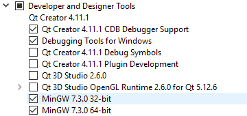

# CalculatOOPr
Kelompok 8

# Instalasi
Download Qt Creator bisa <a href="https://www.qt.io/download-open-source?hsCtaTracking=9f6a2170-a938-42df-a8e2-a9f0b1d6cdce%7C6cb0de4f-9bb5-4778-ab02-bfb62735f3e5">disini</a>

Pas download, ntar disuruh bikin akun. Habis bikin akun bakal disuruh mau install yang mana aja, pilih yang ini:



Setelah install. Buka Qt Creator, terus buka file ```CalculatorOOP.pro```

# Expression Evaluator
Udah dibikin, udh bisa ekspresi negatif, nested (dalam kurung dll gitu), contoh:
```
1 + 4
1 + 2 * 3
1 + sin ( 30 )
1 + sqrt ( 2 + sqrt ( 8 * sin ( 30 ) ) )
1 - 2 + -3
```

Tinggal compile ExpressionEvaluator.cpp terus jalanin aja exe nya. Belum disambungin ke GUI