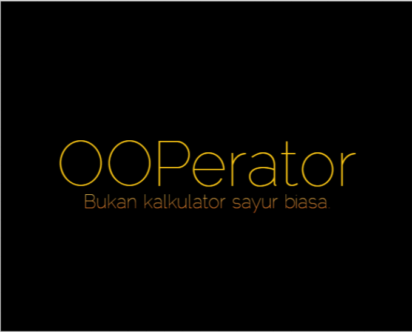
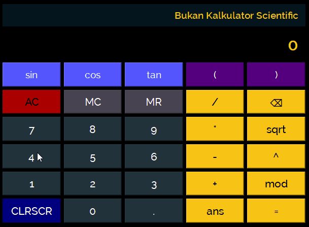
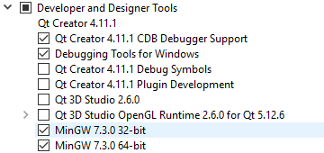
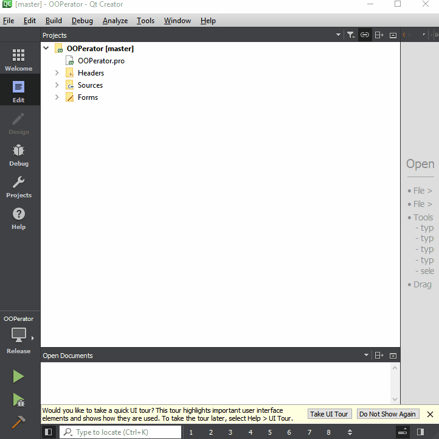
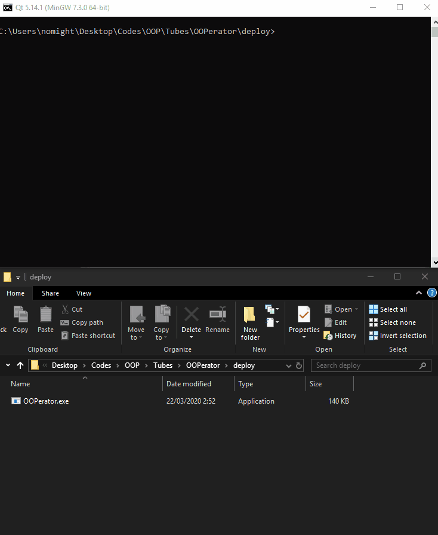
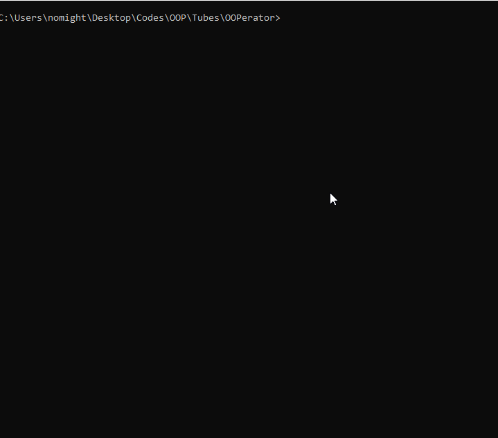
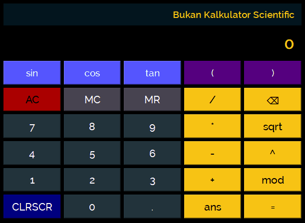

# OOPerator

Calculator sederhana yang memanfaatkan konsep OOP dalam implementasinya.
Proyek ini merupakan tugas besar mata kuliah IF2210-Pemrograman Berorientasi Objek 2019/2020.

## Overview

Kalkulator sayur ini memiliki fitur dasar kalkulator sayur pada umumnya
* Perhitungan operasi biner (tambah, kurang, kali, bagi)
* Perhitungan operasi uner (akar)
* Fitur memory ans dan queue (MC dan MR)
* Exception handling
* Evaluasi ekspresi biner sederhana (A opr B)

dan tentu saja, OOPerator adalah kalkulator sayur yang mumpuni, sehingga memiliki fitur tambahan seperti berikut
* Perhitungan operasi biner lanjutan (pow, mod) 
* Perhitungan operasi uner lanjutan (sin, cos, tan)
* Menangani ekspresi kurung
* Evaluasi ekspresi lanjutan, contoh: sqrt(182 * 100 + 25) + 1 - cos(0)

## Getting Started
Instruksi berikut adalah bagaimana cara menyiapkan enviroment proyek ini untuk keperluan pengembangan maupun pengujian. Di dalam proyek ini juga sudah tercantum file executable yang sudah tidak perlu di build lagi.

### Prerequisites

Berikut adalah keperluan enviroment dari proyek ini

* C++ 11
* Qt Creator

### Installing

Installer Qt Creator dapat diunduh melalui tautan [berikut](https://www.qt.io/download-open-source).

Pada tahap instalasi, silakan memilih komponen-komponen berikut



## Deploying

Untuk dapat membangun aplikasi ini secara keseluruhan pada sistem Anda, Anda hanya perlu membuka OOPerator.pro dengan Qt Creator dan melakukan proses build dari situ.




Dalam proyek ini juga telah diberikan file executable yang sudah di build dengan dependencynya pada folder ```deploy```. Jika anda ingin mendeploy dari awal, dapat menggunakan perintah berikut pada Qt
```
windeployqt.exe --quick --no-translations .
```


## Unit Testing

Unit testing dilakukan menggunakan framework Catch2. Testing dilakukan untuk setiap Expression, dan beberapa fungsi-fungsi kelas Parser.

Untuk melakukan kompilasi unit test, dapat menjalankan script compile Unit Test (cUT.bat)
```
cUT
```

Untuk menjalankan unit test untuk semua modul, maka jalankan run Unit Test (rUT.bat)
```
rUT
```
jika, ingin menjalankan unit test untuk suatu modul yang diinginkan, maka jalankan script rUT dengan memberikan argumen berupa nama modul yang ingin dicoba
Sebagai contoh
```
rUT Divide
```


Anda juga dapat memberikan lebih dari satu argumen untuk menguji lebih dari satu modul
```
rUT Add Divide
```

Berikut adalah list modul-modul yang diujikan
* Add
* Substract
* Divide
* Multiply
* Pow
* Mod
* Queue (otw)
* Parser (otw)


## Documentation
Dokumentasi dapat diakses di docs/html/index.html, dokumentasi ini dibuat menggunakan Doxygen.

## Project Structure
Berikut adalah struktur folder dari proyek ini ini
```
+---bin
+---deploy
+---docs
|   +---html
|   +---latex
|   config
|
\---src
    |   main.cpp
    |   OOPerator.pro
    |   OOPerator.pro.user
    |
    +---Calculator
    |       Calculator.cpp
    |       Calculator.hpp
    |       calculator.ui
    |
    +---Exception
    |       BaseException.hpp
    |       DivideWithZeroException.hpp
    |       Exception.hpp
    |       ImbalancedParanthesesException.hpp
    |       InvalidDecimalException.hpp
    |       ModException.hpp
    |       MoreThanOneOperatorException.hpp
    |       NegativeSqrtException.hpp
    |       NoParanthesisInUnaryException.hpp
    |       UndefinedOperatorException.hpp
    |
    +---Expression
    |   |   Expression.cpp
    |   |   Expression.hpp
    |   |   TerminalExpression.cpp
    |   |   TerminalExpression.hpp
    |   |
    |   +---Binary
    |   |       AddExpression.cpp
    |   |       AddExpression.hpp
    |   |       BinaryExpression.cpp
    |   |       BinaryExpression.hpp
    |   |       DivideExpression.cpp
    |   |       DivideExpression.hpp
    |   |       ModExpression.cpp
    |   |       ModExpression.hpp
    |   |       MultiplyExpression.cpp
    |   |       MultiplyExpression.hpp
    |   |       PowExpression.cpp
    |   |       PowExpression.hpp
    |   |       SubstractExpression.cpp
    |   |       SubstractExpression.hpp
    |   |
    |   +---Other
    |   |       ExpressionMain.cpp
    |   |
    |   \---Unary
    |           CosExpression.cpp
    |           CosExpression.hpp
    |           NegativeExpression.cpp
    |           NegativeExpression.hpp
    |           SinExpression.cpp
    |           SinExpression.hpp
    |           SqrtExpression.cpp
    |           SqrtExpression.hpp
    |           TanExpression.cpp
    |           TanExpression.hpp
    |           UnaryExpression.cpp
    |           UnaryExpression.hpp
    |
    +---Parser
    |       Parser.cpp
    |       Parser.hpp
    |
    \---Test
            AddTest.cpp
            all.hpp
            catch.hpp
            DivideTest.cpp
            MainTest.cpp
            ModTest.cpp
            MultiplyTest.cpp
            PowTest.cpp
            SqrtTest.cpp
            SubstractTest.cpp
```

## Built With

* [C++](https://www.cplusplus.com/) - Bahasa pemrograman
* [Qt](https://www.qt.io/) - GUI toolkit
* [Catch2](https://github.com/catchorg/Catch2) - Unit test framework
* [Doxygen](http://www.doxygen.nl/) - Documentation generator

## Authors

* **Faris Fadhilah** - *13518026*
* **Michael Hans** - *13518056*
* **Arya Beri Argya Rasidi** - *13518131*
* **Michel Fang** - *13518137*

## Notes
Fitur-fitur dasar dan tambahan tidak terlepas dari bug, terutama fitur-fitur yang merupakan spesifikasi *bonus*, oleh karena itu penulis minta maaf atas ketidaksempurnaan program.

## Acknowledgments

* Dosen IF2210 K2, Muhammad Zuhri Catur Candra, ST., MT
* Asisten Pembimbing, Antonio Setya